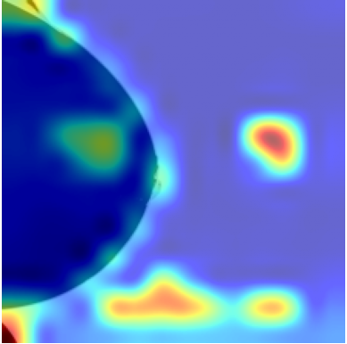
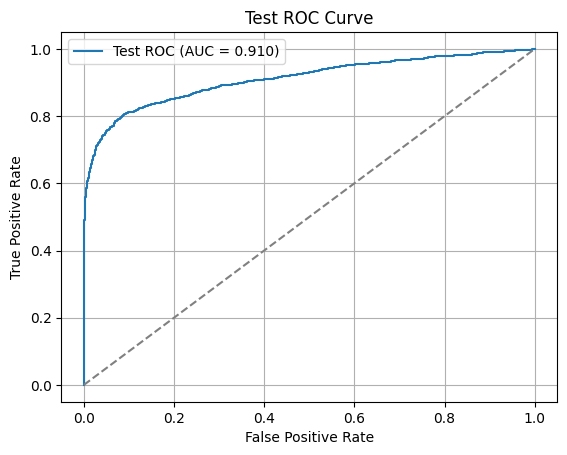
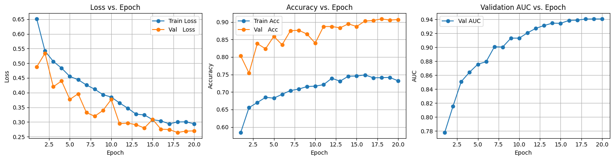

# 🧠 Mammogram Breast Cancer Detection using Vision Transformer (ViT)

This project implements an interpretable deep learning pipeline to classify breast tumors as malignant or benign from mammograms. It combines advanced preprocessing with a hybrid Vision Transformer (ViT + ResNet50) architecture, integrated with CycleGAN augmentation and clinical interpretability tools.

---

## 📊 Key Highlights

- **Dataset**: [VinDr-Mammo](https://physionet.org/content/vindr-mammo/1.0.0/) – 5,000 exams, 20,000 de-identified mammograms from HMUH and H108 hospitals.
- **Preprocessing**: 
  - Wavelet Denoising
  - CLAHE (Contrast Limited Adaptive Histogram Equalization)
  - Unsharp Masking
  - Pectoral Muscle & Background Removal
- **Augmentation**: 
  - GAN-based rare class balancing with **CycleGAN**
  - MixUp and CutMix for regular augmentation
- **ROI Extraction**: Using bounding boxes to crop lesion areas
- **Model**: Vision Transformer (ViT) fused with ResNet50 for feature enhancement
- **Interpretability**: 
  - Attention Rollout
  - Grad-CAM Visualization
- **Result**: Achieved **AUC = 0.91** on test set

---

## 🖼️ Sample Outputs

| Image Type | Example |
|------------|---------|
| Original Mammogram |  |
| Region of Interest (ROI) |  |
| Overlay Box |  |
| Attention Rollout |  |
| ROC Curve |  |
| Training Metrics |  |

---

## 📁 Files in this Repo

| File | Description |
|------|-------------|
| `Mammogram_VIT_Model.ipynb` | Google Colab code (end-to-end) |
| `Report_S372107_RajKumar_Sah.pdf` | Final academic report |
| `*.png` | Visual examples (sample images, attention, ROI, metrics) |
| `requirements.txt` | All necessary packages for reproducibility |
| `README.md` | This documentation file |

---

## 🔍 Dataset Description

**VinDr-Mammo** is a full-field digital mammography dataset comprising:
- **Images**: 4 standard views per exam (L-CC, R-CC, L-MLO, R-MLO)
- **Annotations**:
  - Breast-level BI-RADS assessments & breast density
  - Finding-level bounding boxes and BI-RADS scores
  - Up to 14 types of abnormalities (mass, calcification, asymmetry...)

📥 [Download Link (PhysioNet)](https://physionet.org/content/vindr-mammo/1.0.0/)

---

## 📦 Installation

### 1. Clone the repo

```bash
git clone https://github.com/<your-username>/Mammogram-Breast-Cancer-Detection.git
cd Mammogram-Breast-Cancer-Detection
